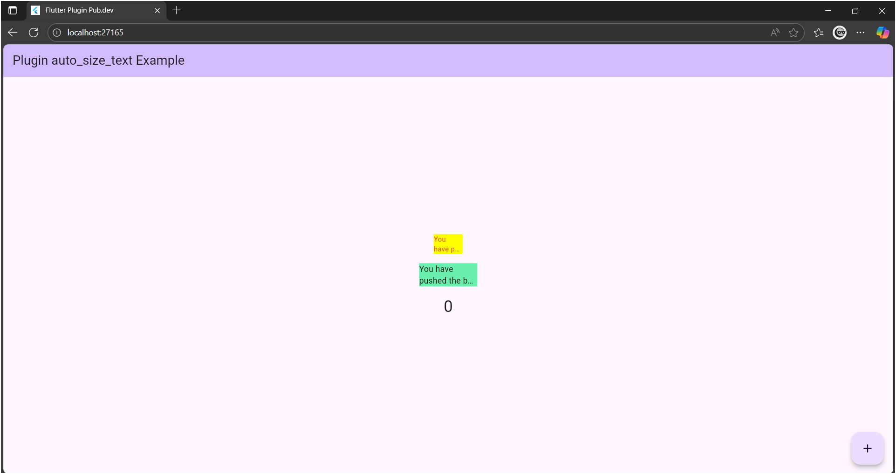

# flutter_plugin_pubdev

## 🧩 Praktikum 7 – Menerapkan Plugin di Project Flutter

Proyek ini dibuat untuk memenuhi tugas **Jobsheet 6 – Pemrograman Mobile**  
dengan tujuan mempelajari cara **menambahkan dan menggunakan plugin dari pub.dev** pada proyek Flutter.

Plugin yang digunakan: **auto_size_text**

---

## 📸 Hasil Tampilan Aplikasi

Berikut hasil akhir saat aplikasi dijalankan:



Pada gambar di atas:
- Kotak **kuning** adalah widget `RedTextWidget` yang menggunakan plugin `AutoSizeText`.  
  Teks otomatis menyesuaikan ukuran font agar muat di area kecil tanpa terpotong.
- Kotak **hijau** adalah widget `Text` biasa yang teksnya terpotong jika terlalu panjang.
- Angka di bawah merupakan hasil counter bawaan Flutter.

---

## 🪄 Penjelasan Setiap Langkah Praktikum

### 🔹 Langkah 2 – Menambahkan Plugin
Perintah:
```bash
flutter pub add auto_size_text

Perintah : tersebut digunakan untuk mengunduh dan mendaftarkan plugin auto_size_text ke dalam file pubspec.yaml pada bagian dependencies. Plugin ini berfungsi untuk membuat teks secara otomatis menyesuaikan ukuran font agar muat di dalam batas layout tanpa terpotong (overflow).

Dengan menjalankan perintah ini:
Flutter akan menghubungkan proyek dengan pustaka auto_size_text dari pub.dev.

---

### 🔹 Langkah 5 – Membuat Variabel dan Parameter Constructor

Kode yang ditambahkan pada file `red_text_widget.dart`:
```dart
final String text;

const RedTextWidget({Key? key, required this.text}) : super(key: key);

Penjelasan:

Langkah ini bertujuan untuk memperbaiki error yang muncul pada langkah sebelumnya dan membuat widget RedTextWidget dapat menerima teks dari luar.

---

### 🔹 Langkah 6 – Dua Widget yang Ditambahkan pada `main.dart`

Potongan kode yang ditambahkan:
```dart
Container(
  color: Colors.yellowAccent,
  width: 50,
  child: const RedTextWidget(
    text: 'You have pushed the button this many times:',
  ),
),
Container(
  color: Colors.greenAccent,
  width: 100,
  child: const Text(
    'You have pushed the button this many times:',
  ),
),

Pada langkah ini ditambahkan dua widget untuk membandingkan hasil tampilan teks antara widget yang menggunakan plugin auto_size_text dan widget Text bawaan Flutter.

---

### 🔹 Penjelasan Tiap Parameter pada Plugin `auto_size_text`

Berdasarkan dokumentasi resmi di [pub.dev/packages/auto_size_text](https://pub.dev/packages/auto_size_text),  
plugin ini memiliki beberapa parameter penting yang digunakan untuk mengatur perilaku teks agar dapat menyesuaikan ukuran secara otomatis.

| Parameter              | Jenis         | Fungsi        | Penjelasan |
|------------            |--------       |---------      |------------|
| `text`                 | `String`      | Wajib diisi   | Isi teks yang akan ditampilkan dan disesuaikan 
                                                           ukurannya agar muat dalam batas layout.
| `style`                | `TextStyle`   | Opsional      | Mengatur tampilan teks seperti warna, ukuran font,
                                                           ketebalan huruf (`fontWeight`), dan jenis font (`fontFamily`).
| `maxLines`             | `int`         | Opsional      | Menentukan jumlah baris maksimum teks yang akan ditampilkan. 
                                                           Jika lebih dari batas, teks akan dipotong atau dikecilkan ukurannya.
| `minFontSize`          | `double`      | Opsional      | Ukuran **minimum** font yang diizinkan ketika teks dikecilkan. 
                                                           Nilai default biasanya `12.0`.
| `maxFontSize`          | `double`      | Opsional      | Ukuran **maksimum** font yang boleh digunakan. Biasanya mengikuti 
                                                           ukuran font dari `style`.
| `stepGranularity`      | `double`      | Opsional      | Menentukan **tingkat perubahan ukuran font** saat teks disesuaikan. 
                                                           Nilai yang lebih kecil membuat penyesuaian lebih halus. 
| `overflow`             | `TextOverflow`| Opsional      | Mengatur bagaimana teks ditampilkan jika masih tidak muat 
                                                           (misalnya `TextOverflow.ellipsis` akan menampilkan “...”). 
| `overflowReplacement`  | `Widget`      | Opsional      | Menentukan **widget pengganti** jika teks tidak bisa ditampilkan 
                                                           walaupun sudah dikecilkan.
| `presetFontSizes`      | `List<double>`| Opsional      | Menentukan daftar ukuran font yang boleh dipilih otomatis 
                                                           oleh `AutoSizeText`.
| `textAlign`            | `TextAlign`   | Opsional      | Mengatur perataan teks seperti kiri (`left`), tengah (`center`), 
                                                           kanan (`right`), atau justify. |
| `group`                | `AutoSizeGroup`| Opsional     | Digunakan untuk **menyamakan ukuran font** di beberapa widget 
                                                           `AutoSizeText` agar memiliki ukuran konsisten. |

**Kesimpulan:**  

Parameter-parameter tersebut memberikan fleksibilitas bagi developer untuk mengontrol cara teks beradaptasi dengan ruang tampilan.  
Dengan `auto_size_text`, teks dapat tampil **lebih responsif, proporsional, dan mudah dibaca** di berbagai ukuran layar tanpa overflow.